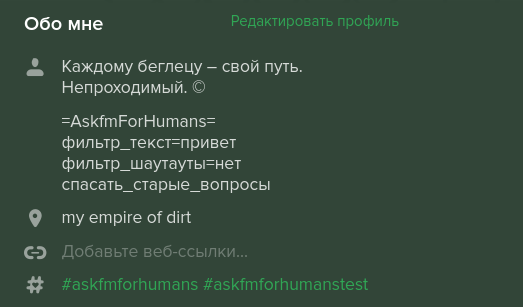

## Наведение порядка в инбоксе Аска

Вот что мы уже умеем 🚀
- удалять или помечать прочитанными все шаутауты (killer feature 😏😏😏!)
- удалять вопросы, содержащие заданный текст
- спасать старые вопросы от автоматического удаления
- удалять старые вопросы, не дожидаясь автоматического удаления

Более детально о настройках сервиса будет сказано ниже.

## Как это работает

Сервис реализован в виде бота (на данный момент это [@ask4humans](https://ask.fm/ask4humans)), который заходит в Аск от имени пользователей (используя их логины и пароли, потому что более безопасные технологии в Аске не реализованы) и совершает полезные действия.

Подключение бота к аккаунту пока происходит в ручном режиме. Для этого напиши мне в [Аске](https://ask.fm/jgrdlgrd) или [Телеге](https://t.me/snowwm). И не забудь поставить себе в профиль хештег `#askfmforhumans`!

## Подводные камни

- Бот будет заходить в твой профиль с IP-адресов другой страны. Это может быть чревато, например, временным попаданием в рейтинг Ирландии вместо России.
- Веб версия Аска будет разлогинивать тебя при каждом закрытии браузера.
- На данный момент (и, вероятно, навсегда) **бот находится в стадии тестирования и может работать нестабильно**.
- Автоматизация противоречит правилам Аска. Как минимум, она может в любой момент сломаться. Как максимум, Аск может применять любые санкции, но пока такого не наблюдалось.

## Настройка бота

Для настройки взаимодействия бота со своим профилем добавь в конец описания профиля (раздел "О себе") строку `=AskfmForHumans=`.
Следующие строки содержат название настройки, знак равенства и одно из допустимых значений (описаны ниже).
Для настроек типа `да/нет` можно писать только название без знака равенства, это будет рассматриваться как `да`.

Вот как это может выглядеть:



Такая конфигурация будет делать 3 вещи:
- помечать все шаутауты прочитанными (эта функция включена по умолчанию), но не удалять их (потому что `фильтр_шаутауты=нет`)
- раз в сутки (потому что не указано иное) удалять все вопросы со словом "привет"
- спасать от автоматического удаления вопросы старше года

Все настройки и их возможные значения перечислены ниже (**жирным** выделены значения по умолчанию).

### Базовые функции

- *Ключ*: `читать_шаутауты`  
  *Значения*: **да**/нет  
  *Комментарий*: Сразу же помечать уведомления о шаутаутах как прочитанные.

- *Ключ*: `спасать_старые_вопросы`  
  *Значения*: да/**нет**  
  *Комментарий*: Аск автоматически удаляет из инбокса вопросы старше года. Если включить, бот будет предотвращать удаление вопроса, отвечая на него и сразу удаляя ответ. При этом вопрос переместится в вершину инбокса.
  
- *Ключ*: `удалять_вопросы_старше_N_дней`  
  *Значения*: положительное целое число  
  *Комментарий*: Функция, противоположная предыдущей — позволяет автоматически избавляться от старых вопросов, не дожидаясь, когда пройдёт год. Применять с острожностью :)
  
- *Ключ*: `стоп_машина`  
  *Значения*: да/**нет**  
  *Комментарий*: Приостановить любые действия с профилем.

### Фильтры
  
- *Ключ*: `фильтр_шаутауты`  
  *Значения*: **да**/нет  
  *Комментарий*: Удалять из инбокса любые шаутауты. Отключение этой настройки не отменяет действия других фильтров на шаутауты.
  
- *Ключ*: `фильтр_текст`  
  *Значения*: любой текст  
  *Комментарий*: Удалять вопросы, в которых встречается заданный текст (без учёта регистра).
  
- *Ключ*: `фильтр_регвыр`  
  *Значения*: [регулярное выражение](https://ru.wikipedia.org/wiki/Регулярные_выражения)  
  *Комментарий*: Продвинутая версия текстового фильтра. Выражения интерпретируются функцией [`re.search`](https://docs.python.org/3/library/re.html#re.search) стандартной библиотеки Python.

### Настройки фильтров
  
- *Ключ*: `фильтр_только_анон`  
  *Значения*: да/**нет**  
  *Комментарий*: Применять фильтры только к анонимным вопросам (так можно снизить количество спама, не подвергая риску неанонимные вопросы).
  
- *Ключ*: `фильтр_блок_авторов`  
  *Значения*: да/**нет**  
  *Комментарий*: При удалении вопроса также блокировать ("кидать в ЧС") его автора, чтобы не получать повторных вопросов от этого человека. Работает даже для анонимных вопросов.
  
- *Ключ*: `фильтр_режим`  
  *Значения*: непрерывно/**ежедневно**/по_запросу  
  *Комментарий*: Непрерывный вариант фильтрует вопросы в режиме реального времени, так что ты их даже не увидишь. Другие режимы позволяют успеть прочитать полученные вопросы и ответить на понравившиеся или пометить их как "нужные". *Режим "по запросу" и сохранение "нужных" вопросов пока не реализованы.*

### Продвинутый пример настроек

```
=AskfmForHumans=
фильтр_текст=привет
фильтр_текст=пока
фильтр_регвыр=(?i)добр\w+ (утр|де?н|ноч|вече)\w+
фильтр_только_анон
удалять_вопросы_старше_N_дней=100
```

- Во-первых, этот пример показывает, что можно добавить несколько фильтров типа `текст` или `регвыр` в разных строках.
В данном случае будут удаляться вопросы со словами "привет" или "пока", а также (благодаря регулярному выражению) различные приветствия в духе "доброе утро" или "доброй ночки".
- Во-вторых, инбокс будет также очищаться от вопросов старше ста дней.
- В-третьих, эти фильтры (а также включенный по умолчанию фильтр шаутаутов) не коснутся личных вопросов, потому что включена настройка `фильтр_только_анон`.

<!--
## Вопросы и ответы

**В: Администрация Аска не против этого безобразия?**  
О: Подозреваю, что мою лавочку прикроют, если у неё будет достаточно много пользователей. Поэтому можно считать, что проект предназначен только для узкого круга лиц.
-->
